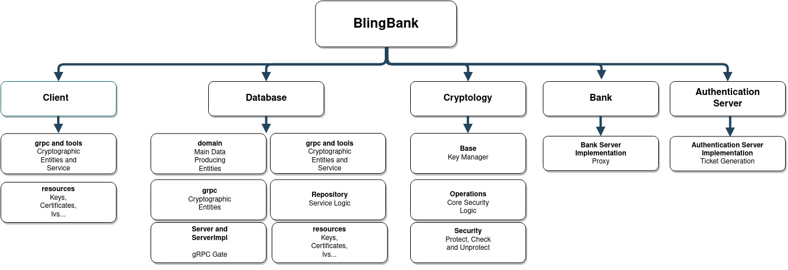
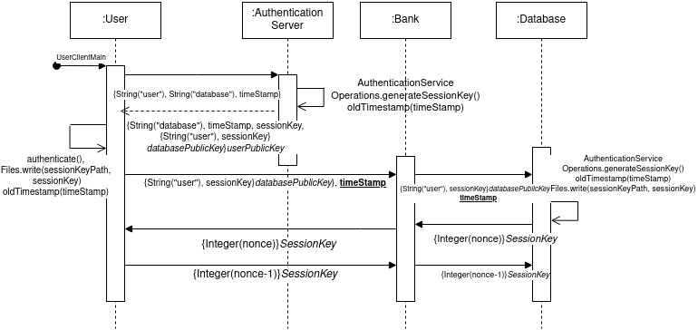

# A28 BlingBank

## 1. Introduction

We decided to create a banking solution following the document format presented to us for BlingBank. We offer the option to create or delete a single account
or an account with multiple users, to add a movement or show all movements and to create a payment order (see [security challenge](#security-challenge)) that may result
in a transfer between users, requiring approval of all users for shared accounts. We applied a secure document format that ensures authenticity, confidentiality, integrity
and non-repudiation. Our solution has a user service, a bank proxy, a database and an authentication server (see [security challenge](#security-challenge)).
#### Business Scenario

_"The banking industry, more than any other branch, feels a very high pressure from its clients to offer online banking solutions
that follow state-of-the-art security protocols. As such, we will try to develop a banking service for BlingBank with focus on
authenticity, confidentiality, integrity, non-repudiation as well as resistance and various attacks."_

Figure 1: BlingBank's Key Compontents UML Structure Diagram

## 2. Project Development

### 2.1. Secure Document Format

#### 2.1.1. Design

The database and the user are the two ending points of the communication that takes place in our gRPC based system. The database
handles requests through the observer interface that manages responses from a streaming RPC call, being its core
DatabaseServerImpl.java. The user sends requests through stubs built with a specific channel that through the bank proxy relay
reaches the database or the authentication server for the session's key distribution. It is important to note that all gRPC services are defined with only a byte stream field for requests
and responses. With this in mind, on the user's side, we begin with, for all commands, a Json with the user's username,
password and timestamp along with the other fields for that particular command, that Json is then
serialized and encrypted so we can build our gRPC request. In order to encrypt the serialized Json we use a specific
Cryptographic Core entity which then calls our Security class - this class contains
the most fundamental cryptographic operations as static methods, namely protect, check and unprotect. These methods can be
called isolatedly in the client.

- **Protect** - This method takes a message, a symmetric session key, a session initialization vector and a private key, returning a protected document, containing
at the beginning a signature produced with the messageSignature method from our Operations class which produces a signature with the digest
from the message and the private key of the signer (the receiving end would, through the same scheme, call messageValidation with the public key of the signer on that initial
part of the message to verify the signature, ensuring authenticity, non-repudiation and integrity) and the cryptogram encrypted with the session key right after, assuring confidentiality.

- **Check** - This method is used in the database, it begins by decrypting the cryptogram
received with the session's key and then calls the messageValidation method from the Operations class which performs the inverse operation of the messageSignature
method.

- **Unprotect** - This method performs the inverse steps of the protect method and calls check to ensure that the contents of the message
were not modified.

On the other end of the communication process, namely the database, inverse operations are performed, like for instance the deserializing of the json and
the analysis of the timestamp against replay attacks, as well as the corresponding operations for the command specified. A reply is then prepared using the same methods
but with entities specific to the database that perform the same core security measures.

Furthermore, both the user and the database have a cryptographic manager entity, which, through a specific builder, holds the paths to the
ivs, session keys, public and private keys needed by the cryptographic core, which ensures the needed protection. We were able to maintain
a high degree of isolation among modules. To the best of our understanding, this design solution tackles all necessities
imposed by the previously presented business scenario.

##### Example

If the client wanted to get the account balance, he would write his username and password with the command _balance_, and through the userService class,
a Json with the username, the hashed password, and the timestamp would be generated, this json would then be serialized to an array of bytes and converted to a byte stream which would then be encrypted with the cryptographic manager, which in turn would end up applying the protect method. This method creates
a signature with a SHA-256 digest of the whole message and the private key of the client, the signature would then be added to the beginning of
the protected document along with the message which was encrypted using the symmetric session key that was previously distributed among user and database with an
initialization vector also distributed for that session using "AES/CBC/PKCS5Padding". The secure document is then passed to the command request and the user waits for a response.
Finally, to analyze the response gotten from the database the decrypt and check methods are called, making sure the contents of the message were not modified.

#### 2.1.2. Implementation

We used Java 17, Maven 3.9 and PostgreSQL 16.1
Regarding the modules used we worked with java's security module to get access to utilities such as PublicKey, Signature and the apache's decoder and hex encoder for manipulating byte arrays.
We also used modules such as javax's KeyGenerator, SecretKey, Cipher and IvParameterSpec, among others.

####Challenges

The development and encapsulation of our multi-layered base structure proved itself to be very complex. The security challenge which involved expanding the database's logic and creating an authentication was also a task that was rather strenuous, specially taking into account the we were only two elements working on this project, nevertheless, we were able to achieve a solution through a higher work output. We
were also unable to get the firewall running satisfaci

### 2.2. Infrastructure

#### 2.2.1. Network and Machine Setup

We built a tripartite structure comprised of a postgres database server, a domain and database management server providing 
the backbone of the service logic, effectively, the service's core, and a bank server facade responsible for relaying 
the client's requests to the core.   

The server core, i.e. the database server, the server facade, i.e. the bank server, and the client communicate through
the use of remote procedure calls encrypted with TLS.   

We opted for postgres as our relational database management system as it is supported on all major operating systems 
and, nonetheless having the fastest database engine in the domain of relational databases, it has an extensive developer
community and ecosystem that provides feature sets that prove to be great time savers. As a side note, we ended up 
using one of these feature sets, namely pgcrypto, to encrypt our persistent data at rest.

To interface the database into our application, we made use of the hibernate framework for its ease of use requiring 
only an XML configuration file and for its versatility and more fine-grained control features readily available through 
the use of annotations.

Regarding the communication between the server modules and between them and the client, we chose to employ Google's 
(open sourced) gRPC since it provides a language agnostic platform with integrated security features and TLS support for authentication features, being
a game changer tool for IPC (inter process communication) and offering high performance code generation tools that bolster developing speed.

#### 2.2.2. Server Communication Security

Wielding gRPC security features, implementing secure communication channels was relatively straightforward: we created 
self-signed certificates for each server entity and trust managers for each client recognizing their respective server's 
certificates.

Initially, the database server and the client have each other's public keys and a predefined iv, the secret key used to 
encrypt the messages sent between them is generated through the use of the Needham-Schroeder algorithm.

### 2.3. Security Challenge {#security-challenge}

#### 2.3.1. Challenge Overview

The security challenge exposed the most critical flaws in our project, namely, the lack of a dynamic key distribution. 
We henceforth endeavored the implementation of a set of features to guard against that weakness.
This, ultimately, resulted in the creation of an authentication server, whose main function is providing a ticket for
the session using the Needham-Schroeder algorithm, which allows for the creation of a symmetric key and iv for a session 
between the user and the database, as the authentication server has both the user's and the database's public keys.

#### 2.3.2. Attacker Model

The database, the bank and the authentication server are fully trusted by the user, who is responsible for checking
the validity of all the responses received from made requests and relayed to them by the bank proxy. An attacker would not be able to penetrate
the channels and messages running through it without accessing the resources folders of each identity. However, an attack
on the channels would be possible without a properly set firewall.

#### 2.3.3. Solution Design and Implementation

##### Needham-Schroeder Algorithm

Figure 2: Sequence Diagram of our Implementation of the NS Algorithm. Note: The session key was sent along with a freshly generated ***Iv***.

The Needham-Schroeder algorithm allows for the establishment of a shared symmetric session key and iv between the user and the 
database. We used this protocol to dynamically distribute a key in a session. This key, which is used on every message 
between the parties, ensures confidentiality. The authenticity, integrity and non-repudiation is guaranteed with the use of the digital signature when 
the user then proceeds to communicate with the database. We made a small modification to the Needham-Schroeder Algorithm 
in the third step, where the user relays to the server the ticket encrypted with the database's public key along with a 
timestamp to prevent replay attacks, a major liability of the algorithm, identified by Denning and Sacco[1]. We also made a small
modification in which we also pass a randomly generated iv with the session key. We guarded against the duplication of orders by including a timestamp in each query sent from the user to the database. In this robust 
freshness measure the database holds a list of all the already seen timestamps for each distinct request and promptly
detects a replay attack if a previously used timestamp is detected.

##### Payment Orders

Regarding accounts owned by multiple users, payment orders are of such nature that they only go through when all owners 
make that same order.

##### Firewall Design

We designed a firewall that mediates all packages that originate in the user direction bank. In this design the user
would send their requests to the firewall, which would then be redirected to the bank relay through prerouting. Furthermore, we would only allow forwarding of packages that are already part of an established connection. A SSH connection rate limit would also take place allowing only up to 10 new connections per 5 seconds, a rate which would not hinder regular users and would guard the system against DDoS attacks. The initialization and termination scripts for the firewall were designed to run as soon as a VM boots up through maven and right before one is shut down. Although we
were not able to have the firewall up and running, we think that this solution would greatly improve the project's security. The firewall's implementation
resides in the Scripts folder.

## 3. Conclusion

The proposed solution presents the core features of an online banking app. At the end of our project we were able to satisfy the main necessities posed by our business scenario, i.e. authenticity, confidentiality, integrity, non-repudiation, as well as resistance against replay attacks and message freshness, along with the security challenge.
We were unable to get the firewall running due to the difficulties felt when configuring maven's java VMs to run each initialization script
appropriately. A possible enhancement would be to get the firewall running and creating a naming server.

With this project we were able to get a basic grasp on common security protocols and how to implement them on larger scale projects. We think that this
experience was very valuable for our skills as software engineers due to the sheer value that security specialists
have in today's IT market, furthermore, by working with only two thirds of the team we also had to make serious
time compromises regarding workload and learned how to deal with high pressure. All in all, we think it was a very enriching experience.

## 4. Bibliography

[1]: Denning, Dorothy E.; Sacco, Giovanni Maria (1981). "Timestamps in key distribution protocols". *Communications of the ACM*, 24 (8), 533–535. doi: [10.1145/358722.358740](https://doi.org/10.1145/358722.358740). S2CID: [3228356](https://citeseerx.ist.psu.edu/viewdoc/summary?doi=10.1.1.308.7106).

----
END OF REPORT
